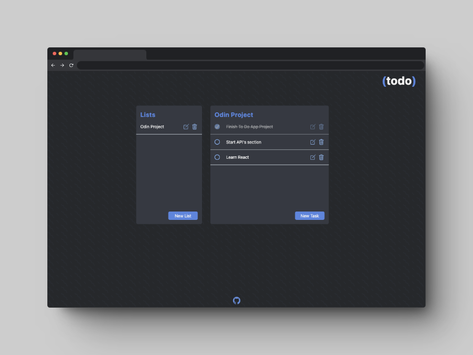

# To Do App #

  

  

  <a href="https://scottwright-dev.github.io/odin-project-todo-list/">Click here for demo</a>

### Description
Develop a dynamic To-Do list application as per the <a href="https://www.theodinproject.com/lessons/node-path-javascript-todo-list">assignment</a> from The Odin Project curriculum.

### Assignment Brief:

- Create 'todos' as objects, generated using factory functions or constructors/classes.
- Each 'todo' task must contain properties such as title, description, dueDate, and priority, with the option of notes or a checklist.
- Implement a system of projects or separate todo lists. On first launch, todos should populate a default project or list. Users must be able to create new projects and assign todos accordingly.
- Decouple application logic (creating, completing, modifying todos) from DOM operations. House these functionalities in distinct modules.
- Design the UI, ensuring users can:
- View all lists and their respective tasks.
- Expand a todo for detail view or editing.
- Delete a task or list.
- Incorporate the date-fns library for date and time functions.
- Implement data persistence using the Web Storage API, specifically localStorage. Ensure the app's stability even if localStorage data retrieval fails.

### Technologies used:
- JavaScript
- HTML
- CSS
- Webpack
- Npm
- Date-fns library for date formatting
- Web API local storage for data persistence

### What I learnt

- Implementing the Single Responsibility Principle from the <a href="https://medium.com/@cramirez92/s-o-l-i-d-the-first-5-priciples-of-object-oriented-design-with-javascript-790f6ac9b9fa">SOLID design principles</a>.
- Strategising a well-organised, modular codebase using ES6 modules, import & export, and encapsulation to deter potential conflicts.
- Implementing the MVC design pattern for better code maintenance, ensuring separation of model, view, and control functionalities.
- Keeping functionalities loosely coupled for better flexibility.
- Utilising the date-fns library for date data formatting.
- Incorporating localStorage using the web API for persistent data storage.
- Implementation of html dialog element as modals for data input for an enhanced user experience.

### Thoughts and Observations

Realizing and executing my initial ideas came with its own set of complexities. Staying true to the Single Responsibility Principle, while maintaining modularity, proved to be a challenge. My research while brainstorming the project led me to discover the <a href="https://developer.mozilla.org/en-US/docs/Glossary/MVC">MVC</a> design pattern, which provided a valuable framework for better code organisation. For the most part, I believe my code meets the above requirements. However, some of the more intricate functions could benefit from further refactoring to reduce their complexity as well as reconsider some of the names for more concise understanding of each function. Given the scope of this project, however I believe the current state is satisfactory.

### Additional features & enhancement ideas 

- Implement a confirmation prompt before the deletion of tasks or lists.
- Integrate further functionalities from the date-fns library for refined task organisation based on due dates, such as daily, weekly, or monthly categorisation.
- Transition to a more robust database storage system.
- Refactor some of the more complex functions to better adhere to the single responsibility principle of SOLID.
- Add full functionality to the mobile version of the app, which currently only supports the ability to use one default 'Tasks" list.
